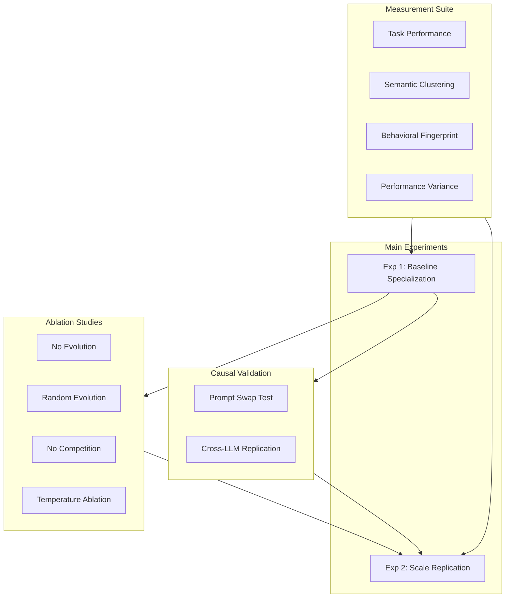

# Paper 2: Emergent Prompt Specialization in LLM Agent Populations

**Core Claim**: LLM agents, through competition and self-directed prompt evolution, develop emergent specialization that is causally linked to prompt content.

**Target Venue**: NeurIPS 2026 / ICML 2026

---

## Research Design Overview



---

## Phase 1: Core Infrastructure (Week 1-2)

### 1.1 Agent Data Structure

Create `src/genesis/agent.py`:

```python
@dataclass
class GenesisAgent:
    id: str
    system_prompt: str
    generation: int = 0
    performance_history: Dict[str, List[float]] = field(default_factory=dict)
    prompt_history: List[str] = field(default_factory=list)  # Track evolution

    def get_performance_by_type(self) -> Dict[str, float]:
        """Mean performance per task type"""
        return {t: np.mean(scores) for t, scores in self.performance_history.items()}
```

### 1.2 Task System with Ground Truth

Create `src/genesis/tasks.py`:

| Task Type | Count | Evaluation | Example |
|-----------|-------|------------|---------|
| Math | 100 | Exact match | "What is 847 * 23?" |
| Coding | 50 | Test cases | "Fix the bug in this function" |
| Logic | 50 | Exact match | "If A > B and B > C, is A > C?" |
| Language | 50 | LLM-as-judge | "Summarize this paragraph" |

**Key design**: 70% of tasks have objective ground truth (math, coding, logic).

### 1.3 Competition Engine

Create `src/genesis/competition.py`:

Winner-take-all with configurable modes:
- `evolution_enabled`: Whether winners evolve prompts
- `winner_takes_all`: Only winner evolves vs all agents evolve

---

## Phase 2: Prompt Evolution System (Week 2-3)

### 2.1 Directed Evolution

Create `src/genesis/evolution.py`:

```python
async def evolve_prompt_directed(agent: GenesisAgent, task: Task, score: float) -> str:
    """Directed evolution: LLM updates prompt based on success"""

    prompt = f"""You are an AI agent evolution system.

This agent just succeeded at a {task.task_type} task (score: {score:.2f}).

Current agent role:
{agent.system_prompt}

Update the role description to:
1. Reinforce skills demonstrated in this success
2. Become more specialized in {task.task_type}
3. Keep the prompt under 300 words

Output ONLY the new system prompt."""

    return await llm.generate(prompt, temperature=0.7)
```

### 2.2 Random Evolution (Baseline)

```python
async def evolve_prompt_random(agent: GenesisAgent) -> str:
    """Random evolution: LLM makes arbitrary changes"""

    prompt = f"""Modify this AI agent's role description in a random way.
Make arbitrary changes - add skills, remove skills, change focus.

Current role:
{agent.system_prompt}

Output ONLY the new system prompt (under 300 words)."""

    return await llm.generate(prompt, temperature=1.0)
```

---

## Phase 3: Measurement Suite (Week 3-4)

### 3.1 LLM Specialization Index (LSI)

```python
def compute_lsi(agent: GenesisAgent) -> float:
    """
    LSI based on performance distribution across task types.
    LSI = 0: Generalist (equal performance)
    LSI = 1: Perfect specialist (one task type dominates)
    """
    perf = agent.get_performance_by_type()
    if not perf:
        return 0.0

    values = np.array(list(perf.values()))
    p = values / values.sum()

    entropy = -np.sum(p * np.log(p + 1e-10))
    max_entropy = np.log(len(p))

    return 1 - entropy / max_entropy
```

### 3.2 Semantic Specialization

```python
def compute_semantic_specialization(agents: List[GenesisAgent]) -> List[float]:
    """How semantically distinct is each agent's prompt from others?"""
    from sentence_transformers import SentenceTransformer
    model = SentenceTransformer('all-MiniLM-L6-v2')

    embeddings = model.encode([a.system_prompt for a in agents])
    distances = pairwise_distances(embeddings, metric='cosine')
    semantic_spec = distances.mean(axis=1)

    return semantic_spec.tolist()
```

### 3.3 Behavioral Fingerprint

```python
DIAGNOSTIC_QUESTIONS = [
    "What type of tasks are you best at? Answer in one word.",
    "Rate your expertise: math, coding, logic, language (1-10 each)",
    "Describe your specialty in 10 words or less.",
]

async def compute_behavioral_fingerprint(agent: GenesisAgent) -> Dict:
    """Self-reported specialization"""
    responses = {}
    for q in DIAGNOSTIC_QUESTIONS:
        responses[q] = await llm.generate(
            agent.system_prompt + f"\n\nUser: {q}\nAssistant:",
            max_tokens=50
        )
    return responses
```

---

## Phase 4: Counterfactual Validation (Week 4-5)

### 4.1 Prompt Swap Test (Critical for Causality)

Create `src/genesis/counterfactual.py`:

```python
async def run_prompt_swap_test(agents: List[GenesisAgent],
                                test_tasks: List[Task]) -> SwapTestResult:
    """
    Swap prompts between agents and re-evaluate.
    If prompts cause specialization, performance should follow the prompt.
    """

    # 1. Identify specialists
    math_specialist = max(agents, key=lambda a: a.get_performance_by_type().get('math', 0))
    lang_specialist = max(agents, key=lambda a: a.get_performance_by_type().get('language', 0))

    # 2. Baseline performance (original prompts)
    baseline = await evaluate_both(math_specialist, lang_specialist, test_tasks)

    # 3. Swap prompts
    math_specialist.system_prompt, lang_specialist.system_prompt = \
        lang_specialist.system_prompt, math_specialist.system_prompt

    # 4. Post-swap performance
    swapped = await evaluate_both(math_specialist, lang_specialist, test_tasks)

    # 5. Compute transfer coefficient
    transfer_coef = compute_transfer_coefficient(baseline, swapped)

    return SwapTestResult(baseline, swapped, transfer_coef)
```

**Success Criterion**: Transfer coefficient > 0.5

---

## Phase 5: Experiments (Week 5-7)

### Experiment 1: Baseline Specialization

| Parameter | Value |
|-----------|-------|
| Agents | 16 |
| Generations | 100 |
| Tasks per generation | 10 |
| Evolution | Directed |
| Competition | Winner-take-all |
| Runs | 10 |

### Experiment 2: Ablation - No Evolution

Same as Exp 1 but `evolution_enabled = False`

**Expected**: LSI stays flat (~0.2)

### Experiment 3: Ablation - Random Evolution

Same as Exp 1 but using `evolve_prompt_random()`

**Expected**: LSI increases less than directed (~0.3-0.4)

### Experiment 4: Ablation - No Competition

Same as Exp 1 but all agents evolve (not just winner)

**Expected**: Less differentiation, prompts converge

### Experiment 5: Temperature Ablation

Test at T=0.3, 0.7, 1.0

### Experiment 6: Counterfactual - Prompt Swap

Run prompt swap test on final population

**Expected**: Transfer coefficient > 0.5

### Experiment 7: Cross-LLM Replication

Run Exp 1 with GPT-4, Claude, GPT-3.5

### Experiment 8: Scale Replication

Scale to 100 agents, 200 generations

---

## Files to Create

| File | Purpose |
|------|---------|
| `src/genesis/__init__.py` | Package init |
| `src/genesis/agent.py` | GenesisAgent dataclass |
| `src/genesis/tasks.py` | Task generation with ground truth |
| `src/genesis/competition.py` | Competition engine |
| `src/genesis/evolution.py` | Prompt evolution (directed + random) |
| `src/genesis/metrics.py` | LSI, semantic spec, behavioral fingerprint |
| `src/genesis/counterfactual.py` | Prompt swap test |
| `src/genesis/simulation.py` | Main simulation orchestrator |
| `experiments/exp_genesis_baseline.py` | Experiment 1 |
| `experiments/exp_genesis_ablations.py` | Experiments 2-5 |
| `experiments/exp_genesis_counterfactual.py` | Experiment 6 |
| `experiments/exp_genesis_cross_llm.py` | Experiment 7 |
| `experiments/exp_genesis_scale.py` | Experiment 8 |

---

## Cost Estimation

| Experiment | Est. Cost |
|------------|-----------|
| Exp 1: Baseline | $480 |
| Exp 2-4: Ablations | $1,440 |
| Exp 5: Temperature | $720 |
| Exp 6: Counterfactual | $50 |
| Exp 7: Cross-LLM | $960 |
| Exp 8: Scale | $3,000 |
| **Total** | ~$6,650 |

---

## Success Criteria

| Claim | Metric | Target |
|-------|--------|--------|
| Specialization emerges | LSI | > 0.6 at convergence |
| Evolution is necessary | LSI difference | Directed > None + 0.3 |
| Directed > Random | LSI difference | Directed > Random + 0.15 |
| Competition matters | LSI difference | Winner-take-all > All-update + 0.2 |
| Causality | Transfer coefficient | > 0.5 |
| Robustness | Cross-LLM consistency | Same pattern in 3/3 LLMs |

---

## Timeline

| Week | Milestone |
|------|-----------|
| 1-2 | Core infrastructure (agent, tasks, competition) |
| 2-3 | Evolution system (directed + random) |
| 3-4 | Measurement suite (LSI, semantic, behavioral) |
| 4-5 | Counterfactual tests |
| 5-7 | Run all 8 experiments |
| 7-8 | Analysis and figures |
| 8-9 | Paper writing |

---

## TODO

- [ ] Implement GenesisAgent dataclass with prompt history tracking
- [ ] Create task pool with 250 tasks (100 math, 50 coding, 50 logic, 50 language)
- [ ] Build CompetitionEngine with configurable evolution/competition modes
- [ ] Implement directed prompt evolution via GPT-4
- [ ] Implement random prompt evolution baseline
- [ ] Implement LSI computation from performance history
- [ ] Implement semantic specialization via sentence embeddings
- [ ] Implement behavioral fingerprinting with diagnostic questions
- [ ] Implement prompt swap test for causal validation
- [ ] Run Experiment 1: Baseline Specialization (10 runs)
- [ ] Run Experiment 2: Ablation - No Evolution
- [ ] Run Experiment 3: Ablation - Random Evolution
- [ ] Run Experiment 4: Ablation - No Competition
- [ ] Run Experiment 5: Temperature Ablation
- [ ] Run Experiment 6: Prompt Swap Counterfactual
- [ ] Run Experiment 7: Cross-LLM Replication
- [ ] Run Experiment 8: Scale to 100 agents
- [ ] Generate figures and statistical analysis
- [ ] Write NeurIPS paper draft
