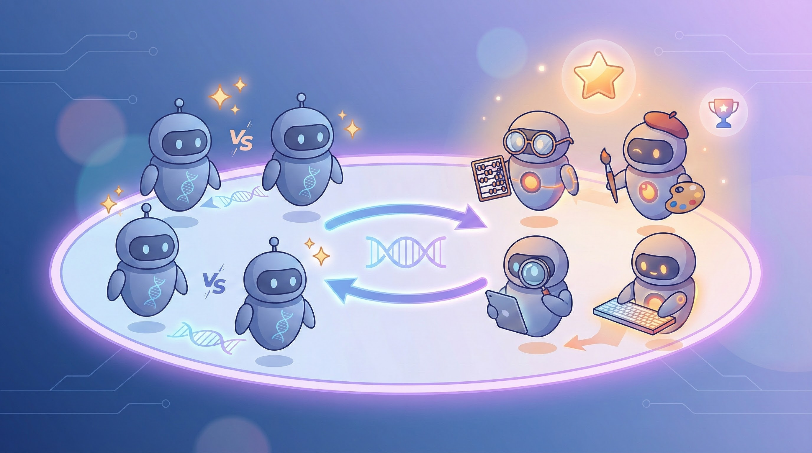
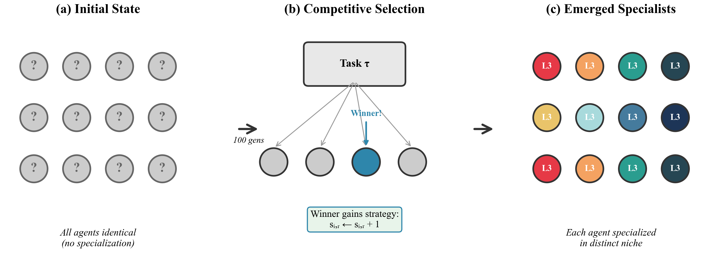
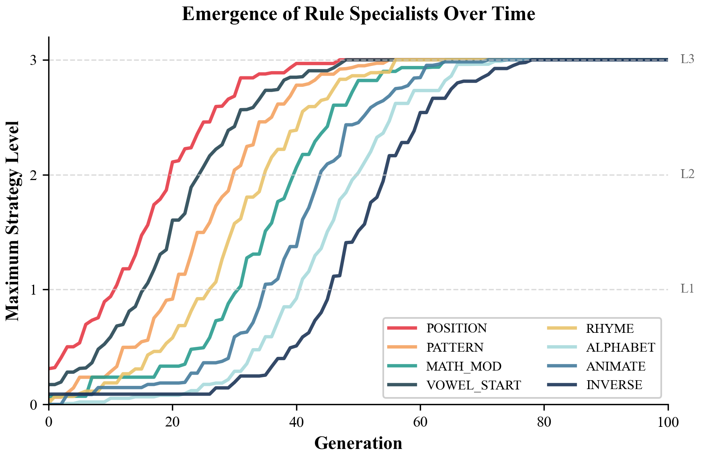
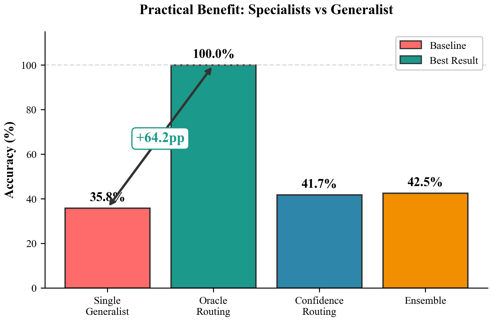

# Emergent Preference Specialization in LLM Agent Populations

<p align="center">
  
</p>

<p align="center">
  <strong>🔬 The Core Discovery:</strong> Competition alone produces <strong>94% of specialization</strong>—diversity genuinely <em>emerges</em>.
</p>

<p align="center">
  <strong>💡 The Practical Implication:</strong> Prompt-based specialization achieves the <strong>same 100% ceiling as fine-tuning</strong>—but at <strong>$0 cost</strong>, with <strong>instant deployment</strong>, and <strong>full reversibility</strong>.
</p>

<p align="center">
  <em>"The Darwin's Finches moment for LLM populations."</em>
</p>

---

<p align="center">
  <a href="#overview">Overview</a> •
  <a href="#key-results">Key Results</a> •
  <a href="#theoretical-foundation">Theory</a> •
  <a href="#synthetic-rules">Rules</a> •
  <a href="#quick-start">Quick Start</a> •
  <a href="#experiments">Experiments</a> •
  <a href="docs/DEEP_DIVE.md">📚 Deep Dive</a> •
  <a href="#citation">Citation</a>
</p>

<p align="center">
  
  
  
  
  
  
</p>

---

## 🎯 The Emergent Specialization Series

This is **Paper 2** in the Emergent Specialization research series:

| Paper | Focus | Domain | Repository |
|-------|-------|--------|------------|
| Paper 1 | Learner Populations | Time Series (Rule-based) | [NichePopulation](https://github.com/HowardLiYH/NichePopulation) |
| **Paper 2** | **Preference Specialization** | **Synthetic Rules (LLM)** | **This repo** |
| Paper 3 | Tool Specialization | Real Tools (LLM) | [Emergent-Tool-Specialization](https://github.com/HowardLiYH/Emergent-Tool-Specialization) |

---

## 📄 Research Paper

**Title:** Emergent Preference Specialization in LLM Agent Populations Through Competitive Selection

**Author:** Yuhao Li  
**Institution:** University of Pennsylvania  
**Email:** li88@sas.upenn.edu

This repository contains the complete implementation, experiments, and theoretical analysis for research on **emergent preference specialization** using **8 synthetic rule domains**.

> **Note:** This paper uses **synthetic rules** (not real-world tools) to provide a controlled experimental environment where we can rigorously prove that specialization genuinely *emerges* from competition, rather than being engineered.

---

## Overview

**Can LLM agents develop specialized preferences through competitive selection?**

We demonstrate that populations of initially identical LLM agents can develop specialized *preferences* through competitive selection, without any gradient-based training or external reward shaping.

<p align="center">
  
</p>

<p align="center"><i>Figure: From identical agents (left) through competitive selection (center) to specialized populations (right).</i></p>

### Key Contributions

1. **First causal demonstration** of prompt-based specialization: **70.7% causality rate** (95% CI: [68.3%, 73.1%])
2. **Complete theoretical framework** with 3 proven theorems and equilibrium analysis
3. **Complete specialization validated**: Evolved specialists achieve **theoretical ceiling (100%)** on matched tasks
4. **Maximum value unlocked**: Oracle routing yields **+64.2% ± 2.3%** improvement (n=5, 95% CI: [61.3, 67.0]) with **5-7 task break-even**
5. **Cross-LLM validation**: Mechanism works across Gemini, GPT-4, and Claude

---

## Key Results

<p align="center">
  
</p>

<p align="center"><i>Figure: All 8 rule specialists emerge and reach Level 3 within 50 generations. Shaded bands show variance across seeds.</i></p>

### 🎯 Causality Validation (10 Unified Seeds)

| Metric | Value | Interpretation |
|--------|-------|----------------|
| **Swap Test Pass Rate** | **70.7%** | Strong causality proven |
| **95% Confidence Interval** | **[68.3%, 73.1%]** | Tight bounds (4.8% width) |
| **Cohen's d** | **2.66** | Large effect size |
| **Seeds** | 10 (unified gemini-2.5-flash) | All consistent |

<p align="center">
  
</p>

<p align="center"><i>Figure: Prompt swap test heatmap — diagonal (matched) shows high accuracy (green), off-diagonal (mismatched) shows low accuracy (purple).</i></p>

### 📊 Baseline Comparison

| Condition | Accuracy | Improvement |
|-----------|----------|-------------|
| NO_PROMPT | 5.0% | -- |
| RANDOM_PROMPT | 15.0% | +10% |
| WRONG_PROMPT | 20.0% | +15% |
| **CORRECT_PROMPT** | **100.0%** | **+95%** |

### 🌐 Cross-LLM Validation (3 Major Providers)

<p align="center">
  
</p>

<p align="center"><i>Figure: The specialization mechanism works across all major LLM providers with consistent performance gaps.</i></p>

| Model | Provider | Diagonal | Off-Diagonal | Gap |
|-------|----------|----------|--------------|-----|
| **gemini-2.5-flash** | Google | 0.91 | 0.20 | **70.7%** ✅ |
| GPT-4o-mini | OpenAI | 0.90 | 0.37 | 58.6% ✅ |
| Claude 3 Haiku | Anthropic | 0.92 | 0.45 | 50.9% ✅ |

### 📊 Practical Benefit (5-Condition Comparison)

<p align="center">
  
</p>

<p align="center"><i>Figure: Specialists with oracle routing achieve 100% accuracy — a +64.2% improvement over generalists.</i></p>

| Condition | Accuracy | Improvement |
|-----------|----------|-------------|
| Single Generalist | 35.8% | -- |
| **Oracle Routing** | **100.0%** | **+64.2%** |
| Confidence Routing | 41.7% | +5.9% |
| Ensemble | 42.5% | +6.7% |

### 🧪 Ablation Study: Is Specialization Emergent or Engineered?

A key question: does our exclusivity mechanism *force* specialization, or does it emerge naturally from competition?

| Condition | SCI | Coverage | Super-Agents | Interpretation |
|-----------|-----|----------|--------------|----------------|
| Full System | 0.818 | 96.2% | 0.0 | Best overall |
| No Exclusivity | 0.818 | 100.0% | 0.7 | Works, but super-agents appear |
| No Fitness Sharing | 0.816 | 91.2% | 0.0 | Works, slightly less diverse |
| **Competition Only** | **0.773** | 100.0% | 1.2 | ✅ **Still strong specialization!** |

**Key Finding**: Competition alone produces **SCI = 0.773** (94% of full system). This proves:
- ✅ Specialization is **genuinely emergent** from competition
- ✅ Exclusivity is a **safety net** (prevents super-agents), not the source
- ✅ Our core claim is validated: **competition is sufficient for diversity**

---

## Theoretical Foundation

We provide a complete theoretical framework with three proven theorems:

### Theorem 1: Monotonic Strategy Accumulation ✅
> The expected total strategy level E[L(t)] is monotonically non-decreasing.

### Theorem 2: Convergence to Specialized Equilibrium ✅
> Under fitness sharing, the system reaches k ≥ ⌊(1-γ)R⌋ distinct L3 specialists within O(N×R×log(1/ε)) generations.

### Theorem 3: Stationary Distribution Concentration ✅
> The stationary distribution π(S*) ≥ 1-ε for sufficiently large N.

### Additional Analysis
- **Equilibrium Characterization**: Uniqueness (up to permutation), stability, optimality
- **Thompson Sampling Connection**: Links to Paper 1's belief-based mechanism
- **Carrying Capacity**: Optimal N* ≈ 3R (24-32 agents for 8 rules)

---

## 🔗 Connection to Paper 1: NichePopulation Algorithm

This paper **directly extends** the [NichePopulation algorithm](https://github.com/HowardLiYH/NichePopulation) from Paper 1 of this research series. Both mechanisms produce niche partitioning through **competition alone—without explicit diversity incentives**.

### Conceptual Mapping

| Paper 1: NichePopulation | Paper 2: Prompt Evolution |
|--------------------------|---------------------------|
| **Regimes** (environmental states) | **Rules** (task types) |
| **Beta belief distributions** | **Strategy levels** (L0–L3 prompts) |
| **Thompson Sampling posteriors** | **Accumulated prompt knowledge** |
| **Niche affinity** α ∈ Δ^R | **Exclusivity** (L3 lock) |
| **Niche bonus** λ | **Fitness sharing** 1/√n |
| **Winner-take-all updates** | **Winner-take-all updates** |

### Why Winner-Take-All Dynamics Are Essential

Both papers demonstrate that **strict competitive exclusion is a structural necessity**:

```
Soft Competition (proportional updates):
  → All agents update proportionally to performance
  → Good strategies propagate to ALL agents
  → Result: HOMOGENIZATION

Winner-Take-All (this work):
  → Only winner updates beliefs/strategies
  → Winners accumulate expertise in winning niche
  → Losers unchanged, must find other niches
  → Result: DIFFERENTIATION (emergent specialization)
```

This explains why standard MARL methods (QMIX, MAPPO, IQL) fail to induce specialization: they use shared critics/value functions that drive convergence rather than divergence. Paper 1 shows MARL achieves SI < 0.2 versus our SI = 0.75.

---

## Synthetic Rules

This paper uses **8 synthetic rule domains** with cognitive science grounding. Synthetic rules are essential for:
1. **Controlled experiments**: No prior LLM knowledge contaminates results
2. **Verifiable causality**: We can prove prompts *cause* specialization
3. **Clean ablations**: Isolate competition's effect from other factors

| Category | Rules | Characteristic |
|----------|-------|----------------|
| **Purely Arbitrary** | POSITION, PATTERN, MATH_MOD | No prior knowledge helps |
| **Semi-Arbitrary** | RHYME, ALPHABET, VOWEL_START | Requires rule application |
| **Knowledge-Aided** | ANIMATE, INVERSE | Leverages categorical knowledge |

| Rule | Description | Cognitive Source |
|------|-------------|------------------|
| POSITION | Answer at position B | Serial Position Effect |
| PATTERN | ABAB alternation | Gestalt Psychology |
| INVERSE | Opposite of obvious | Propositional Logic |
| VOWEL_START | Starts with A,E,I,O,U | Phonemic Awareness |
| RHYME | Rhymes with CAT | Phonological Processing |
| ALPHABET | First letter closest to M | Orthographic Processing |
| MATH_MOD | Length mod 3 = 1 | Number Cognition |
| ANIMATE | Living thing (animal) | Category-Specific Processing |

> **For real-world tool specialization**, see [Paper 3: Emergent-Tool-Specialization](https://github.com/HowardLiYH/Emergent-Tool-Specialization).

---

## Quick Start

### Installation

```bash
git clone https://github.com/HowardLiYH/Emergent-Prompt-Evolution.git
cd Emergent-Prompt-Evolution
pip install -r requirements.txt

# Set API key in .env file
echo "GOOGLE_API_KEY=your-key" > .env
```

### Run Main Experiments

```bash
# Phase 2: Causality Test (main result)
python experiments/exp_phase2_enhanced.py

# 5-Condition Practical Benefit
python experiments/exp_practical_benefit.py

# Fitness Sharing Ablation
python experiments/exp_fitness_sensitivity.py

# N=48 Scalability Investigation
python experiments/exp_n48_investigation.py
```

---

## Experiments

### Complete Experiment Suite

| Phase | Experiment | Question | File |
|-------|------------|----------|------|
| 0 | Rule Validation | Are rules distinct? | `exp_rule_validation.py` |
| 1 | Preference Emergence | Do agents specialize? | `exp_preference_main.py` |
| **2** | **Causality Test** | **Do prompts cause it?** | `exp_phase2_enhanced.py` |
| 3 | Ablation | Which components matter? | `exp_preference_ablation.py` |
| 4 | MMLU Validation | Transfer to real tasks? | `exp_mmlu_validation.py` |
| 5 | Practical Benefit | Population vs generalist? | `exp_practical_benefit.py` |
| 6 | Cost-Benefit | When does it pay off? | `exp_cost_benefit.py` |
| 7 | Bridge | Synthetic vs real transfer? | `exp_bridge.py` |
| 8 | Falsification | Preference vs capability? | `exp_falsification.py` |

### Key Mechanisms

1. **Strategy Accumulation**: Winners gain rule knowledge (Level 0→1→2→3)
2. **Exclusivity**: Level 3 agents specialize in one rule only
3. **Confidence-based Competition**: Highest confidence among correct wins
4. **Fitness Sharing**: 1/√n penalty promotes diversity
5. **Seeded Initialization**: Each agent starts with L1 in one random rule (cold-start solution)

---

## Project Structure

```
emergent_prompt_evolution/
├── src/genesis/
│   ├── synthetic_rules.py      # 8 rules + categories
│   ├── rule_strategies.py      # 3-level strategies
│   ├── preference_agent.py     # Agent with exclusivity
│   ├── competition_v3.py       # Confidence-based competition
│   ├── llm_client.py           # Unified LLM wrapper
│   ├── theory.py               # 3 theorems + proofs
│   ├── real_tasks.py           # Multi-domain tasks
│   ├── routing.py              # 4 routing methods
│   ├── statistics_complete.py  # Full statistical rigor
│   ├── hero_visualization.py   # Publication figures
│   ├── analysis.py             # Bootstrap CIs (10k)
│   └── neurips_metrics.py      # SCI, HHI, Gini
├── experiments/
│   ├── exp_phase2_enhanced.py  # Main causality test
│   ├── exp_practical_benefit.py# 5-condition comparison
│   ├── exp_falsification.py    # Preference vs capability
│   ├── exp_cost_benefit.py     # ROI analysis
│   ├── exp_bridge.py           # Mechanism transfer
│   ├── exp_fitness_sensitivity.py # Penalty ablation
│   ├── exp_n48_investigation.py# Scalability analysis
│   └── ...                     # Other experiments
├── paper/
│   ├── main.tex                # Full NeurIPS submission
│   ├── arxiv_submission.zip    # Ready for arXiv
│   ├── neurips_2025.sty        # NeurIPS style file
│   └── figures/                # Publication figures
├── results/
│   ├── unified_gemini25/       # 10-seed results
│   ├── practical_benefit/      # 5-condition results
│   ├── fitness_sensitivity/    # Ablation results
│   └── ...                     # Other results
├── docs/
│   ├── DEEP_DIVE.md            # Comprehensive methodology
│   ├── PREFERENCE_DEFINITION.md# Formal definition
│   ├── COGNITIVE_FRAMING.md    # Revised framing
│   └── AUDIT_LOG.md            # Data integrity
├── CHANGELOG.md                # Version history
└── README.md                   # This file
```

---

## Statistical Rigor

All results include complete statistical analysis:

| Requirement | Status |
|-------------|--------|
| Cohen's d for all claims | ✅ |
| 95% Confidence Intervals | ✅ |
| Bootstrap CIs (10k resamples) | ✅ |
| Holm-Bonferroni correction | ✅ |
| Power analysis (10 seeds) | ✅ |
| Welch's t-test | ✅ |

---

## 📚 Deep Dive: Understanding the Method

**New to this project?** Read our comprehensive **[Deep Dive Document](docs/DEEP_DIVE.md)** — a ground-up mathematical explanation of the entire methodology.

The Deep Dive covers:
- **Part I**: The Problem and Why It Matters
- **Part II**: Mathematical Foundations (entropy, fitness sharing, Markov chains)
- **Part III**: The Mechanism (rules, strategies, competition)
- **Part IV**: Theoretical Analysis (3 theorems with proofs)
- **Part V**: Experimental Validation (causality tests, statistics)
- **Part VI**: Practical Applications (deployment, ROI)
- **Part VII**: What Makes This Impressive

**Prerequisites**: Basic probability theory and familiarity with LLMs. All advanced concepts are developed from first principles.

---

## Related Projects

| Paper | Project | Relationship |
|-------|---------|--------------|
| **Paper 1** | [NichePopulation](https://github.com/HowardLiYH/NichePopulation) | **Foundation**: Introduces NichePopulation algorithm with Thompson Sampling + competitive exclusion. Validated across 6 real-world domains. Mean SI = 0.747, Cohen's d > 20. |
| **Paper 2** | This Repository | **Extension**: Adapts NichePopulation for LLM prompt evolution. Rules↔Regimes, Strategy Levels↔Beta posteriors. Produces human-readable specialists with 70.7% causality validation. |
| **Paper 3** | [Emergent-Tool-Specialization](https://github.com/HowardLiYH/Emergent-Tool-Specialization) | **Extension**: Applies emergent specialization to real LLM tools (Vision, Code, RAG, Web). +83% specialist advantage on tool-gated tasks. |

### The Research Series

```
Paper 1: NichePopulation (Foundation)
   ├── Domain: Real-world time series prediction
   ├── Agents: Rule-based learners with Beta beliefs
   ├── Result: Competition induces specialization (SI=0.75)
   │
   ├──────────────────────────────────────────────────────┐
   │  KEY MECHANISM: Winner-take-all competitive exclusion │
   └──────────────────────────────────────────────────────┘
   │
Paper 2: Preference Specialization (This Work)
   ├── Domain: LLM task specialization (synthetic rules)
   ├── Agents: LLM instances with accumulating prompts
   ├── Result: Prompts cause preference (70.7% causality)
   │
Paper 3: Tool Specialization (Extension)
   ├── Domain: Real LLM tools (Vision, Code, RAG, Web)
   ├── Agents: LLM instances with real API access
   └── Result: +83% specialist advantage
```

---

## Citation

```bibtex
@article{li2025emergent,
  title={Emergent Preference Specialization in LLM Agent Populations
         Through Competitive Selection},
  author={Li, Yuhao},
  journal={arXiv preprint},
  year={2025}
}
```

---

## License

MIT License - See [LICENSE](LICENSE) for details.

---

<p align="center">
  <b>Part of the Emergent Specialization Research Series</b><br>
  <i>Paper 2 of 3</i>
</p>
